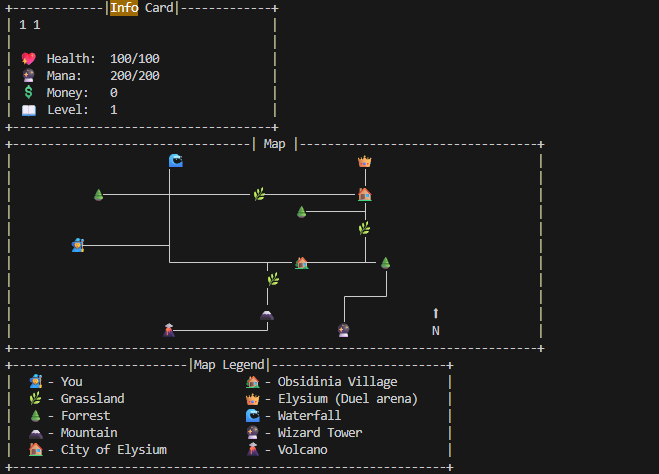

# Elysium-The-duels-of-Arcana
A text adventure all about battling wizards to death(think pokemon style duels in a magical text adventure world). It's a text based magic spell fighting game with exploration of a set world. 

## Story Building
Elysium is a magical realm where magic was once very common. Wizards used their powers for the greater good as healers, protectors and innovators. However a devasting magical war between powerful factions which killed millions and almost destoryed the entire realm, the ruling council of elysium decided to impose strict magical laws. Wizards cannot use magic or harness their gift in anyway.

This meant that Wizards cannot use their natural gifts and be condemmened to an ordinary life as labourers, merchants and farmers.Breaking of the councils rules will lead to exile or execution depending on the extent of the magical rule break. The ruling council of elysium claims that this is for the safety of all but many consider otherwise and claim that the council is scared and fearful of magic itself.

However there is an exception to these extreme rules, The Sacred Duels of Arcana are still allowed. These ritualized battles are held across Elysium, where wizards may unleash their full power in combat. These duels are perfectly safe as Wizards importantly cannot die to magic and will only be knocked out when they reach death levels.

You are a young wizard, born into a world that fears what you are. Your journey begins at your coming of age with only a handful of basic spells. Will you rise through the duels learning powerful spells and challenge the council? Or will you uncover a deeper truth behind the ban?


## Rules/How to play
You will be given all availble actions each round and must use input to navaiget around the mystical world.
You need to enter to corresponding number and complete duels to reach lvl 25 before searching for the council and finding the truth.

### DEMO (Click to go to video)

[](https://hc-cdn.hel1.your-objectstorage.com/s/v3/8ab75db092f5cb367eca0c5d136476713f42ea62_2025-10-16_17-08-00.mp4)


## Installation

## Python option for linux and mac users
1. Download the github repo by using the code button and either clone or download zip. 
2. Open in preferred IDE with python 3.13+ (Didn't test any other py versions besides 3.13.8 so attempt older versions but can't guarantee)
3. Install dependencies

To install the required dependencies, you can run:

```
pip install -r requirements.txt
```
4. Run the program (depends on IDE but you can generally use the terminal command of python main.py)


## Shout out to friends who helped with his example of a fantasy text adv to fix problems like misalligning emojis
## Also credit to them and another friend for inspo for this project
- https://github.com/Mitles1234/Miles-Cutting---Assesment-Task-2----OOP---SE
- https://github.com/Tsunami014/Phoenix-Engine